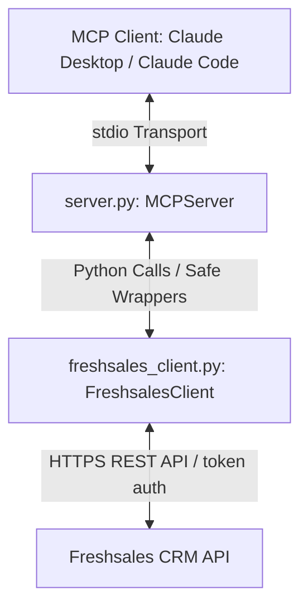

# Freshsales MCP Server - Codebase Documentation

This document provides a comprehensive technical overview of the custom **Freshsales Model Context Protocol (MCP) Server**. It details the architecture, file layout, client integration, exposed tools, configuration, and developer guidelines.

---

## 1. System Architecture & Flow

The codebase acts as a bridge between MCP-compliant clients (such as Claude Desktop or Claude Code) and the Freshsales REST API. It uses a clean, two-layer design:



### Protocol Layer (`server.py`)
- Employs the **Model Context Protocol Python SDK v2** (`mcp.server.MCPServer`).
- Exposes CRM actions to the AI client as discrete tools.
- Automatically handles exceptions using a `_safe()` wrapper to format API errors into legible tool outputs.

### Client Layer (`freshsales_client.py`)
- Implements `FreshsalesClient`, a synchronous wrapper around the `httpx.Client`.
- Handles raw HTTP requests, custom authorization header construction (`Token token=<api_key>`), and pagination.
- Resolves host naming conventions (legacy `.freshsales.io` vs. unified `.myfreshworks.com`).
- Manages **view-based filtering requirements** transparently.

---

## 2. Directory Structure & File Inventory

The folder contains the following assets:

| File / Folder | Role & Purpose |
| :--- | :--- |
| **`server.py`** | The MCP entry point. Declares the `MCPServer("freshsales")` instance, registers all tools, handles configuration loading via `python-dotenv`, and sets up the stdio transport. |
| **`freshsales_client.py`** | The core wrapper class for the Freshsales API. Implements CRUD helpers, global search, and attachment of notes/appointments. |
| **`requirements.txt`** | Python dependencies required for the project: `mcp>=2.0.0`, `httpx>=0.27`, and `python-dotenv>=1.0`. |
| **`.env`** | Local environment variables containing the domain URL and CRM API key. |
| **`claude_desktop_config.snippet.json`** | A configuration template used to register the Freshsales MCP server with Claude Desktop. |
| **`README.md`** | End-user installation, configuration, and setup manual. |
| **`.venv/`** | Python virtual environment containing the runtime environment and dependencies. |
| **`__pycache__/`** | Compiled bytecode directory generated by Python during execution. |

---

## 3. Implementation Details & Core Mechanics

### A. Dynamic URL Resolution
Freshsales hosts accounts across different domains depending on the account creation date. `FreshsalesClient` automatically sanitizes the `FRESHSALES_DOMAIN` variable to build the correct base URL:
* **Unified Freshworks (Post-2020)**: `https://<domain>.myfreshworks.com/crm/sales/api`
* **Legacy Freshsales (Pre-2020)**: `https://<domain>.freshsales.io/api`
* **Custom Base URL**: Direct input paths are used as-is if they end in `/api` or `/crm/sales/api`.

### B. View-Based Entity Listing (The Filter Constraint)
Unlike flat REST endpoints, Freshsales does not allow querying contacts, leads, deals, or sales accounts using a simple `GET /api/contacts` call. You must supply a `view_id`.
* The client overcomes this constraint dynamically by querying `GET /api/<entity>/filters` if no `view_id` is supplied.
* It grabs the first default view (e.g. "All Contacts" or "All Deals") and queries the view endpoint: `GET /api/<entity>/view/<resolved_view_id>`.

```python
# Extract from freshsales_client.py
if entity in self._VIEW_BASED_ENTITIES:
    resolved_view_id = view_id if view_id is not None else self._default_view_id(entity)
    return self.get(f"/{entity}/view/{resolved_view_id}", params=params)
```

### C. Error Handling
API failures (validation issues, unauthorized keys, or rate limits) are encapsulated in the `FreshsalesError` exception. In `server.py`, the `_safe()` wrapper intercepts this and returns a clean, structured JSON object:

```json
{
  "error": true,
  "status_code": 404,
  "message": "Freshsales API error 404: Record not found",
  "details": { "errors": { "code": 404, "message": "Record not found" } }
}
```

---

## 4. Exposed MCP Tools

The server exposes 21 tools across 7 key CRM modules:

### 👤 Contacts
* **`list_contacts(page, per_page, view_id)`**: Paginated listing of contacts.
* **`get_contact(contact_id)`**: Retrieve details of a single contact.
* **`create_contact(fields)`**: Create a contact. Takes a dictionary of fields (e.g., `first_name`, `last_name`, `email`).
* **`update_contact(contact_id, fields)`**: Update fields on an existing contact.
* **`delete_contact(contact_id)`**: Delete contact by ID.

### 🎯 Leads
> [!NOTE]
> Modern unified Freshsales accounts integrate leads and contacts. If your account uses this unified model, calling lead tools will return a `404` or module disabled error.
* **`list_leads(page, per_page, view_id)`**
* **`get_lead(lead_id)`**
* **`create_lead(fields)`**
* **`update_lead(lead_id, fields)`**
* **`delete_lead(lead_id)`**

### 💼 Deals
* **`list_deals(page, per_page, view_id)`**
* **`get_deal(deal_id)`**
* **`create_deal(fields)`**: Fields include `name`, `amount`, `deal_stage_id`, `deal_pipeline_id`.
* **`update_deal(deal_id, fields)`**
* **`delete_deal(deal_id)`**

### 📋 Tasks
* **`list_tasks(page, per_page)`**: Flat tasks listing (does not require a `view_id`).
* **`get_task(task_id)`**
* **`create_task(fields)`**: Fields include `title`, `due_date`, `targetable_type` ("Contact", "Lead", "Deal"), `targetable_id`, `owner_id`.
* **`update_task(task_id, fields)`**
* **`delete_task(task_id)`**

### 📝 Notes
* **`list_notes(targetable_type, targetable_id)`**: Retrieve notes for a specific record type (`contacts`, `leads`, `deals`, `sales_accounts`).
* **`create_note(targetable_type, targetable_id, description)`**: Attach a new note. Internally maps plural type names to the singular uppercase format (e.g., `contacts` -> `Contact`) expected by Freshsales.

### 📅 Appointments
* **`list_appointments(page, per_page)`**
* **`get_appointment(appointment_id)`**
* **`create_appointment(fields)`**: Fields include `title`, `from_date`, `end_date`, `targetable_type`, `targetable_id`.
* **`update_appointment(appointment_id, fields)`**
* **`delete_appointment(appointment_id)`**

### 🔍 Search
* **`search_freshsales(query, entities)`**: Run a global text search. Narrow search using the `entities` parameter (comma-separated list, e.g., `"contact,deal"`).

---

## 5. Developer Guide & Usage Notes

### Pluralization Workarounds
When querying or adding notes, use the pluralized resource endpoint name (e.g. `contacts`, `deals`, `sales_accounts`). The client library automatically normalizes this value when communicating with Freshsales:
```python
# Internal mapper inside freshsales_client.py
"targetable_type": targetable_type.rstrip("s").capitalize()
```

### ID Constraints
Many tool creation operations require IDs instead of text names:
* **Pipelines & Stages**: `deal_pipeline_id` and `deal_stage_id` must be integers.
* **Lead Sources**: `lead_source_id` must be an integer.
* **Owners**: `owner_id` must be the internal Freshsales agent ID.
* *Best Practice*: Perform a `list_deals` or `list_contacts` query first on existing mock records to inspect the active ID mapping, or consult the Freshsales Admin Panel under **APIs & Webhooks**.

### Rate Limiting (HTTP 429)
If the CRM plan limit is exceeded, HTTP 429 is propagated safely as a tool error response. Handle these by introducing backoffs in your execution logic.
